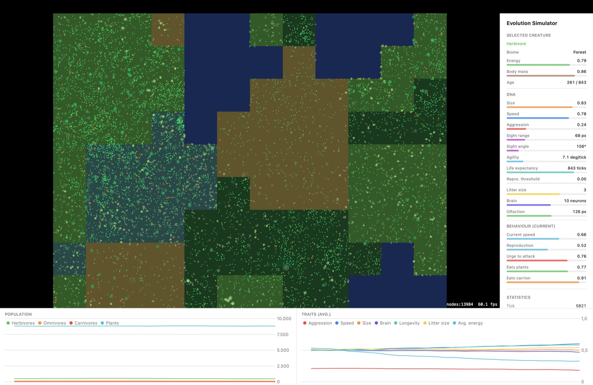

# Swiftolution

An evolution simulator for macOS. A few hundred creatures, each steered by its own
small neural network encoded in its genome, live in a wrap-around world with
plants, corpses, terrain and seasons. Nothing is scripted: hunting, herding,
scavenging, water avoidance and the split into species all have to evolve, or not.

Written in Swift with SwiftUI, SpriteKit and Swift Charts. About 4,600 lines, no
dependencies.



Above: a run about 5,800 ticks in, with biomes enabled. The selected creature is a
herbivore standing in forest; the sidebar shows its genome and, below that, what
its network is deciding to do right now.

## What is actually simulated

**Creatures.** Every creature carries a genome of 532 floats: 14 named genes plus
518 neural network weights. The named genes are speed, sight radius, sight angle,
turn rate, olfaction, size, aggression, maximum age, reproduction threshold,
litter size, brain size and an RGB colour. Everything else about its behaviour
comes out of the network.

**Brains.** A feed-forward network with 25 sensor inputs, one hidden layer of 4-16
neurons (the size is itself a gene) and 6 outputs: turn, speed, reproduce, attack,
eat plants, eat carrion. The inputs cover the nearest food and creature in the
field of view, local density, herding direction, the colour of the nearest
creature, own energy, own senescence, recent feeding rate, plant smell, the biome
underfoot, and a directional bearing per biome across the landscape.

**Metabolism.** Energy is conserved. Maintenance costs scale quadratically with
the traits that drive them, so specialists beat generalists. Body mass is stored
separately from the metabolic battery — it builds up when well fed, is
catabolized when starving, and determines how nourishing the corpse will be.

**Reproduction.** Sexual when a compatible partner is nearby, asexual otherwise.
Parents pay for their offspring out of their own energy; children never receive
more than the parents spent.

**Speciation.** With assortative mating enabled, creatures only mate with
genetically similar partners, so reproductive isolation and visible species
clusters can form.

**Terrain.** Five biomes — grassland, forest, desert, wetland, water — laid out as
contiguous Voronoi regions. They modulate fertility, growth, movement speed and
sight cover, and water is impassable, which turns lakes into barriers that split
populations geographically.

**Seasons.** A cosine cycle modulating plant growth, with configurable year length
and amplitude.

The reasoning behind the numbers — why carrion digestibility has a floor, why
genetic distance uses four genes rather than the whole genome, why terrain has its
own perception horizon — is in [docs/DESIGN.md](docs/DESIGN.md).

## Running it

Requirements: macOS 26.3 or newer and Xcode 26. Open `Swiftolution.xcodeproj` and
run the `Swiftolution` scheme.

The window shows the world on the left, a sidebar of live statistics and
parameters on the right, and population and trait charts along the bottom. Click
any creature to open an inspector showing its genome, its current sensor readings
and what its network is deciding to do. Most parameters take effect immediately;
world size, starting population and biomes need a restart.

Food capacity starts at the top of its range on purpose. That is the bootstrap
phase: the population establishes itself and grows to the ceiling. Once it is
stable, turn the food down — that is where selection pressure comes from and where
it gets interesting. Starting scarce instead mostly produces an extinction; the
reasoning is in the design notes.

The interface is available in English and German.

## Watching it headlessly

`Tools/Headless/run.sh` compiles the UI-free core with `swiftc` and runs the
simulation without a window, uncapped — several thousand ticks per second. No
Xcode project involved. It exists so that a run can be observed and analysed
programmatically, by a script or by an LLM agent.

```bash
./Tools/Headless/run.sh --ticks 20000 --interval 1000 --biomes
```

```bash
./Tools/Headless/run.sh --help
```

Beyond the aggregate table it offers:

- `--detail` — an ASCII world map with terrain and creature density, trait
  histograms, a per-interval breakdown of causes of death, and sample individuals
  at inspector level of detail
- `--json` — NDJSON snapshots, one object per interval
- `--events` — a live stream of births and deaths, with cause, per tick
- `--trace` — a behaviour trace following individual creatures tick by tick, with
  all 25 sensor inputs and 6 outputs, so a decision can be read as
  perception -> action
- `--reduce-food-at T C` — change the food capacity mid-run, repeatable

A note on method: start a run at maximum food, let the population stabilize, and
only then reduce the capacity to raise selection pressure. A run started under
scarcity usually dies before evolution has anything to work with.

## Tests

```bash
xcodebuild test -project Swiftolution.xcodeproj -scheme Swiftolution -destination 'platform=macOS'
```

61 unit tests over the simulation core: genetics and mutation bounds, the feeding
and toxin rules, energy conservation across reproduction and predation, seasons,
corpse decay, biome invariants (including a 400-tick integration run asserting
that nothing ever ends up in water), directional terrain perception, and the
classification of causes of death.

## Layout

```
Swiftolution/Simulation/   the model: World, Creature, DNA, NeuralNetwork,
                           Biome, SpatialGrid, FoodSource
Swiftolution/Engine/       SimulationEngine and StatisticsTracker — the clock and
                           the observable layer the views bind to
Swiftolution/Rendering/    SpriteKit scene and creature nodes
Swiftolution/UI/           SwiftUI sidebar, inspector and charts
Tools/Headless/            the console runner
docs/DESIGN.md             why the simulation is tuned the way it is
```

Every file in `Simulation/` imports nothing but Foundation and CoreGraphics. That is
what lets the headless runner compile the directory on its own with `swiftc`, and it
is why the runner globs it rather than listing files: anything added there is part of
the model by construction. The Combine and SpriteKit dependencies start one directory
over, in `Engine/`.

## License

MIT — see [LICENSE](LICENSE).
